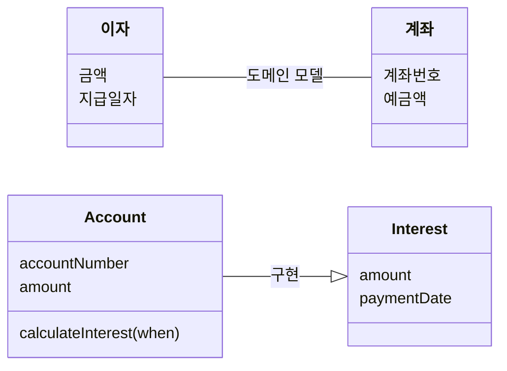
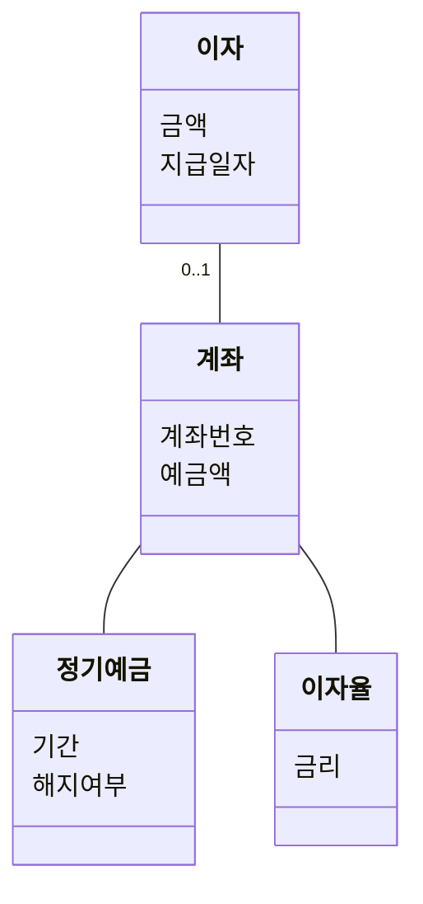
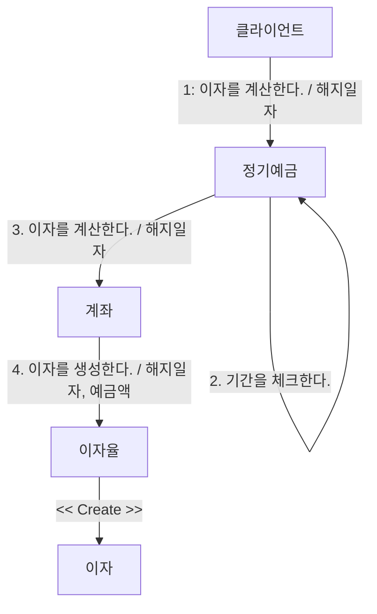
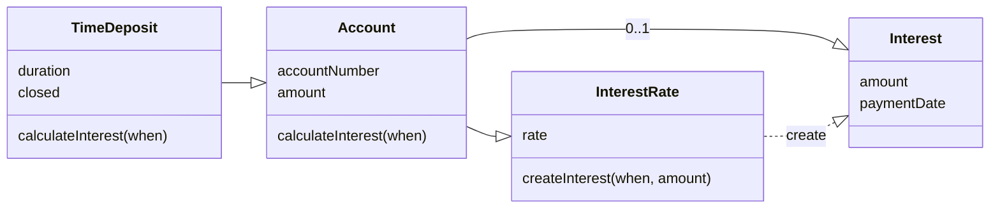
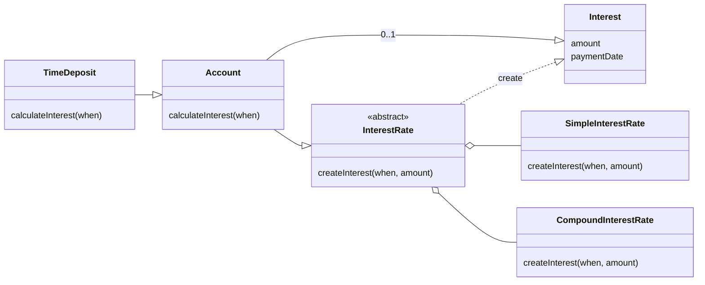
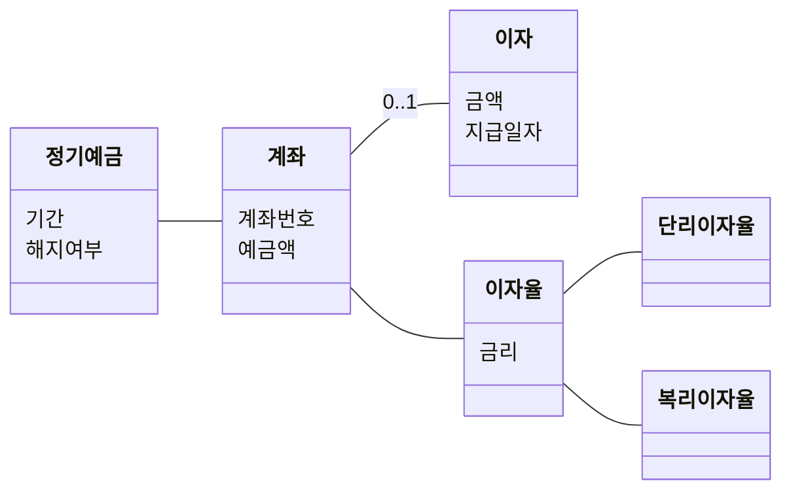

# 객체지향의 사실과 오해

이야기해볼 거리
1. 자율적인 객체란 상태와 행위를 지닌 객체다. 그러면 우리가 흔히 쓰는 컨트롤러, 서비스, 레파지토리는 객체지향 설계라고 볼 수 있을까?
2. 객체는 행동을 통해 상태를 변경할 수 있어야 자율적이고 유연한 객체라고 설명한다. 그렇다면 불변객체는 객체지향 패러다임과 일치하지 않는 설계인가?
3. 설계를 진행할 때 차이점은 과감하게 무시하고 공통점만을 취해 단순화하는 생각이 필요하다.


## 01. 협력하는 객체들의 공동체

```
시너지를 생각하라. 전체는 부분의 합보다 크다.  
- 스티븐 코비(Stephen R. Covey)
```

> 실세계의 모방이라는 개념은 객체지향의 기반을 이루는 철학적인 개념을 설명하는 데는 적합하지만  
> 유연하고 실용적인 관점에서 객체지향 분석, 설계를 설명하기에는 적합하지 않다.

> 객체지향의 목표는 실세계를 모방하는 것이 아니다.  
> 오히려 새로운 세계를 창조하는 것이다.  
> 소프트웨어 개발자의 역할은 단순히 실세계를 소프트웨어 안으로 옮겨 담는 것이 아니라  
> 고객과 사용자를 만족시킬 수 있는 신세계를 창조하는 것이다.

> 객체를 스스로 생각하고 결정하는 현실 세계의 생명체에 비유하는 것은 상태와 행위를 '캡슐화'하는  
> 소프트웨어 객체의 '자율성'을 설명하는 데 효과적이다.

### 손님 - 캐시어 - 바리스타
> 각자의 역할은 주문할책임, 주문받고 전달하는 책임, 커피를 만드는 책임으로 존재한다.  
> 각자의 역할은 서로 협력을 통해서 최종적으로 커피를 만들고, 전달하는 공통적인 목표가 있다.

### 역할, 책임, 협력

- 여러 객체가 동일한 역할을 수행할 수 있다.
- 역할은 대체 가능성을 의미한다.
- 각 객체의 책임을 수행하는 방법은 자율적으로 선택할 수 있다.
- 하나의 객체가 동시에 여러 역할을 수행할 수 있다.

### 협력 속에 사는 객체

#### 두 가지의 덕목
- 객체는 '협력적'이어야 한다.
- 객체는 '자율적'이어야 한다.

> 객체 공동체에 속한 객체들은 공동의 목표를 달성하기 위해 협력에 참여하지만,  
> 스스로의 결정과 판단에 따라 행동하는 자율적인 존재하다.

#### 상태와 행동을 함께 지닌 자율적인 객체

> 객체를 상태(state)와 행동(behavior)을 함께 지닌 실체라고 정의한다.  
> 커피를 제조하는 바리스타가 제조 방법을 모른다는 것이 말이 되지 않는 것처럼  
> 객체가 어떤 행동을 하기 위해 필요한 상태를 알지 못한다는 것 역시 말이 되지 않는다.

> 객체는 다른 객체가 '무엇(what)'을 수행하는지는 알 수 있지만, '어떻게(how)'수행하는지에 대해서는 알 수 없다.

> 객체지향에서는 데이터와 프로세스를 객체라는 하나의 틀 안에 함께 묶어 놓음으로써 객체의 자율성을 보장한다.  
> 자율적인 객체로 구성된 공동체는 유지보수가 쉽고 재사용이 용이한 시스템을 구축할 수 있는 가능성을 제시한다.

#### 협력과 메시지 / 메서드와 자율성

> 객체지향의 세계에서는 오직 한 가지 의사소통 수단만이 존재한다. 이를 '메시지'라고 한다.  

> A객체에서 B객체에게 요청하는 것을 메시지 전송, 요청을 받는 B객체에서는 메시지를 수신한다고 한다.  

> 메시지를 전송하는 객체를 송신자(sender), 메시지를 수신하는 객체를 수신자(receiver)라고 부른다.

> 메시지 처리 방법을 메서드(method)라고 부른다.  
> 클래스 안에 포함된 함수 또는 프로시저를 통해 구현이 된다.  
> 메서드 호출을 전송이라고 표현하며, 메서드 실행을 수신이라고 표현한다.

> 외부의 요청이 무엇인지를 표현하는 메시지와 요청을 처리하기 위한 구체적인 방법인 메서드를 분리하는 것은 객체의 자율성을 높이는 핵심 메커니즘이다.  
> 이것은 캡슐화라는 개념과도 깊이 관련돼 있다.  
> 메시지를 인터페이스, 메서드를 구현객체라고 생각할 수 있을 것 같다.


### 객체지향의 본질

- 객체지향이란 시스템을 상호작용하는 **자율적인 객체들의 공동체**로 바라보고 객체를 이용해 시스템을 분할하는 방법이다.
- 자율적인 객체란 **상태**와 **행위를 함께 지니며 스스로 자기 자신을 책임지는 객체를 의미한다.
- 객체는 시스템의 행위를 구현하기 위해 다른 객체와 **협력**한다. 각 객체는 협력 내에서 정해진 **역할**을 수행하며 역할은 관련된 **책임**의 집합이다.
- 객체는 다른 객체와 협력하기 위해 메시지를 전송하고, **메시지**를 수신한 객체는 메시지를 처리하는 데 적합한 **메서드**를 자율적으로 선택한다.

#### 객체를 지향하라

> 지나치게 클래스를 강조하는 프로그래밍 언어적인 관점은 객체의 캡슐화를 저해하고 클래스를 서로 강하게 결합시킨다.  
> 애플리케이션을 협력하는 객체들의 공동체가 아닌 클래스로 구성된 설계도를 보는 관점은 유연하고 확장 가능한 애플리케이션의 구축을 방해한다.

> 훌륭한 객체지향 설계자가 되기 위해 거쳐야 할 첫 번째 도전은 코드를 담는 클래스의 관점에서  
> 메시지를 주고 받는 객체의 관점으로 사고의 중심을 전환하는 것이다.

> 중요한 것은 어떤 클래스가 필요한가가 아니라 어떤 객체들이 어떤 메시지를 주고받으며 협력하는가다.  
> 클래스는 객체들의 협력 관계를 코드로 옮기는 도구에 불과하다.

> 클래스의 구조와 메서드가 아니라 객체의 역할, 책임, 협력에 집중하라.  
> 객체지향은 객체를 지향하는 것이지 클래스를 지향하는 것이 아니다.

## 02. 이상한 나라의 객체

```
객체지향 패러다임은 지식을 추상화하고 추상화한 지식을 객체 안에 캡슐화함으로써 실세계 문제에 내재된 복잡성을 관리하려고 한다.  
객체를 발견하고 창조하는 것은 지식과 행동을 구조화하는 문제다.
- 레베카 워프스브록(Rebecca Wirfs-Brock)
```

### 객체지향과 인지 능력

> 많은 사람들이 객체지향을 직관적이고 이해하기 쉬운 패러다임이라고 말하는 이유는  
> 객체지향이 세상을 자율적이고 독립적인 객체들로 분해할 수 있는 인간의 기본적인 인지능력에 기반을 두고 있기 때문이다.

> 객체지향 패러다임은 인간이 인지할 수 있는 다양한 객체들이 모여 현실 세계를 이루는 것처럼  
> 소프트웨어의 세계 역시 인간이 인지할 수 있는 다양한 소프트웨어 객체들이 모여 이뤄져 있다는 믿음에서 출발한다.  
> 하지만 유사성은 여기까지다.  
> 객체지향 패러다임의 목적은 현실 세계를 모방하는 것이 아니라 현실 세계를 기반으로 새로운 세계를 창조하는 것이다.

전등  
현실 세계: 사람의 손길 없이 스스로 껐다 켰다 하지 못한다.  
소프트웨어 세계: 스스로 껐다 켰다 할 수 있다.  

주문  
현실 세계: 사람이 직접 주문을 계산한다.  
소프트웨어 세계: 주문 객체가 직접 계산한다.  

### 객체, 그리고 소프트웨어 나라

> 객체의 다양한 특성을 효과적으로 설명하기 위해서는 객체를 상태(state), 행동(behavior), 식별자(identitty)를 지닌 실체로 보는 것이 가장 효과적이다.  
  
이 책에서는 객체를 다음과 같이 정의하기로 한다.  
```
객체란 식별 가능한 개체 또는 사물이다.  
객체는 자동차처럼 만질 수 있는 구체적인 사물일 수도 있고, 시간처럼 추상적인 개념일 수도 있다.  
객체는 구별 가능한 식별자, 특징적인 행동, 변경 가능한 상태를 가진다.  
소프트웨어 안에서 객체는 저장된 상태와 실행 가능한 코드를 통해 구현된다.
```  
  
이 책에서는 객체의 상태를 다음과 같이 정의하기로 한다.
```
상태는 특정 시점에 객체가 가지고 있는 정보의 집합으로 객체의 구조적 특징을 표현한다.  
객체의 상태는 객체에 존재하는 정적인 프로퍼티와 동적인 프로퍼티 값으로 구성된다.  
객체의 프로퍼티는 단순한 값과 다른 객체를 참조하는 링크로 구분할 수 있다.
```
  
> 객체는 자율적인 존재라는 점을 명심하라.  
> 객체지향의 세계에서 객체는 다른 객체의 상태에 직접적으로 접근할 수도, 상태를 변경할 수도 없다.  
> 스스로 자신의 상태를 책임져야 한다.  
> 외부의 객체가 직접적으로 객체의 상태를 주무를 수 없다면 간접적으로 객체의 상태를 변경하거나 조회할 수 있는 방법으로 행동을 정의한다.
  
이 책에서는 객체의 행동을 다음과 같이 정의하기로 한다.
```
행동이란 외부의 요청 또는 수신된 메시지에 응답하기 위해 동작하고 반응하는 활동이다.  
행동의 결과로 객체는 자신의 상태를 변경하거나 다른 객체에게 메시지를 전달할 수 있다.  
객체는 행동을 통해 다른 객체와의 협력에 참여하므로 행동은 외부에 가시적이어야 한다.
```
  
상태와 행동 사이에는 다음과 같은 관계가 있다.
- 객체의 행동은 상태에 영향을 받는다.
- 객체의 행동은 상태를 변경시킨다.

> 어떤 객체도 섬이 아니다.  
> 객체는 자신에게 주어진 책임을 완수하기 위해 다른 객체를 이용하고 다른 객체에게 서비스를 제공한다.
  
행동으로 인해 발생하는 결과는 두 가지 관점에서 설명할 수 있다.  
객체의 행동은 이 두 가지 관점의 부수효과를 명확하게 서술해야 한다.  
- 객체 자신의 상태 변경
- 행동 내에서 협력하는 다른 객체에 대한 메시지 전송

#### 상태 캡슐화

> 객체지향의 세계에서 모든 객체는 자신의 상태를 스스로 관리하는 자율적인 존재다.  
> 앨리스 객체의 키를 작게 만드는 것이 앨리스 자신인 것처럼 음료 객체의 양을 줄이는 것은 음료 자신이어야 한다.  
> 따라서 앨리스는 직접 음료의 상태를 변경할 수 없다.  
> 단지 음료에게 자신이 음료를 마셨다는 메시지를 전달할 수 있을 뿐이다.  
> 적절한 정도로 양을 줄이는 것은 메시지를 전달받은 음료 스스로의 몫이다.

> 상태를 잘 정의된 행동 집합 뒤로 캡슐화하는 것은 객체의 자율성을 높이고 협력을 단순하고 유연하게 만든다.  
> 이것이 상태를 캡슐화해야 하는 이유다.

#### 식별자

```
식별자란 어떤 객체를 다른 객체와 구분하는 데 사용하는 객체의 프로퍼티다.  
값은 식별자를 가지지 않기 때문에 상태를 이용한 동등성 검사를 통해 두 인스턴스를 비교해야 한다.  
객체는 상태가 변경될 수 있기 때문에 식별자를 이용한 동일성 검사를 통해 두 인스턴스를 비교할 수 있다.
```

객체  
- 참조 객체(reference object)
- 엔티티(entity)
- ex) Person 사람 클래스

값
- 값 객체 (value object)
- ex) Integer 숫자 클래스

#### 객체의 특성

- 객체는 상태를 가지며 상태는 변경 가능하다.
- 객체의 상태를 변경시키는 것은 객체의 행동이다.
  - 행동의 결과는 상태에 의존적이며 상태를 이용해 서술할 수 있다.
  - 행동의 순서가 실행 결과에 영향을 미친다.
- 객체는 어떤 상태에 있더라도 유일하게 식별 가능하다.

### 기계로의 객체

> 객체의 상태를 조회하는 작업을 쿼리(query),  
> 객체의 상태를 변경하는 작업을 명령(command)

기계로 객체 설명  
> 사용자가 객체 기계의 버튼을 눌러 상태를 변경하거나 상태 조회를 요청하는 것은  
> 객체의 행동을 유발하기 위해 메시지를 전송하는 것과 유사하다.  
> 버튼을 누르는 것은 기계의 사용자지만 눌린 버튼에 따라 어떤 방식으로 동작할지는 기계 스스로 결정한다.  
> 이것은 전달된 메시지에 따라 스스로 판단하고 결정하는 자율적인 객체의 특성을 정확하게 묘사한다.

> 객체에 접근할 수 있는 유일한 방법은 객체가 제공하는 행동 뿐인걸 기계로 잘 표현한다.  
> 사용자는 객체가 제공하는 명령 버튼과 쿼리 버튼으로 구성된 인터페이스를 통해서만 객체에 접근할 수 있다.  
> 기계가 제공하는 버튼을 통해서만 상태에 접근할 수 있다는 점은 객체의 캡슐화를 강조한다.

### 행동이 상태를 결정한다.

> 객체지향에 갓 입문한 사람들이 가장 쉽게 빠지는 함정은 상태를 중심으로 객체를 바라보는 것이다.  
> 초보자들은 먼저 객체에 필요한 상태가 무엇인지를 결정하고 그 상태에 필요한 행동을 결정한다.  
> 애플리케이션 안에 살아갈 앨리스 객체를 설계할 때 초보자들은  
> 앨리스의 객체에게 필요한 상태가 무엇인지를 먼저 찾고, 키와 위치를 앨리스에 추가한다.  
> 그러고 나서야 키와 위치를 변경하거나 조회할 수 있는 행동이 무엇인지를 고민한다.  
> 안타깝게도 상태를 먼저 결정하고 행동을 나중에 결정하는 방법은 설계에 나쁜 영향을 끼친다.  

1. 상태를 먼저 결정할 경우 캡슐화가 저해된다.
   - 상태가 객체 내부로 깔끔하게 캡슐화되지 못하고 공용 인터페이스에 그대로 노출될 확률이 높아진다.
2. 객체를 협력자가 아닌 고립된 섬으로 만든다.
   - 객체가 필요한 이유는 애플리케이션의 문맥 내에서 다른 객체와 협력하기 위해서다.  
   - 불행히도 상태를 먼저 고려하는 방식은 협력이라는 문맥에서 벗어난채 설계되어 협력에 적합하지 못한 객체를 창조하게 된다.
3. 객체의 재사용성이 저하된다.
   - 상태에 초점을 맞춘 객체는 다양한 협력에 참여하기 어렵기 때문에 재사용성이 저하될 수 밖에 없다.

> 협력에 참여한느 훌륭한 객체 시민을 양성하기 위한 가장 중요한 덕목은 상태가 아닌 행동에 초점을 맞추는 것이다.

### 의인화

현실 객체 vs 소프트웨어 객체

> 현실 속에서는 수동적인 존재가 소프트웨어 객체로 구현될 때는 능동적으로 변한다.  
> 소프트웨어 객체를 창조할 때 우리는 결코 현실 세계의 객체를 모방하지 않는다.  
> 오히려 소프트웨어 안에 창조하는 객체에게 현실 세계의 객체와는 전혀 다른 특징을 부여하는 것이 일반적이다.  
> 현실객체가 가지지 못한 추가적인 능력을 보유하는 것이 소프트웨어 객체다.

> 객체지향 설계자로서 우리의 목적은 현실을 모방하는 것이 아니다.  
> 단지 이상한 나라를 창조하기만 하면 된다.  
> 현실을 닮아야 한다는 어떤 제약이나 구속도 없다.  
> 여러분이 창조한 객체의 특성을 상기시킬 수 있다면 현실 속의 객체의 이름을 이용해 객체를 묘사하라.  
> 그렇지 않다면 깔끔하게 현실을 무시하고 자유롭게 여러분만의 새로운 세계를 창조하길 바란다.


## 03. 타입과 추상화

### 추상화를 통한 복잡성 극복

> 현실은 복잡하며 예측 불가능한 혼돈의 덩어리다.  
> 기존에 현실을 반영한 지형이 표시된 지하철 노선도는 사용자에게 불필요한 정보를 제공하고 있었다.  
> 문제는 복잡성의 총체인 현실이라는 괴물을 그대로 수용하기에는 인간이 지니고 있는 인지 능력과 저장 공간이 너무나도 보잘것없다는 점이다.  
> 따라서 사람들은 본능적으로 이해하기 쉽고 예측 가능한 수준으로 현실을 분해하고 단수화하는 전략을 따른다.  
> 해리 백의 지하철 노선도는 불필요한 지형 정보를 제거함으로써 단순함을 달성한 추상화의 훌률한 예이다.  
> 따라서 진정한 의미에서 추상화란 현실에서 출발하되  
> 불필요한 부분을 도려내가면서 사물의 놀라운 본질을 드러나게 하는 과정이라고 할 수 있다.

> 어떤 추상화도 의도된 목적이 아닌 다른 목적으로 사용된다면 오도될 수 있다.  
> 추상화의 수준, 이익, 가치는 **목적에 의존적**이다.  
> 리처드 파인만의 말처럼 "현상은 복잡하다. 법칙은 단순하다. 버릴 게 무엇인지 알라내라."

이 책에서는 추상화를 다음과 같의 정의한다.  
```
어떤 양상, 세부 사항, 구조를 좀 더 명확하게 이해하기 위해 특정 절차나 물체를 의도적으로 생략하거나 감춤으로써 복잡도를 극복하는 방법이다.  
복잡성을 다루기 위해 추상화는 두 차원에서 이뤄진다.  
- 첫 번째 차원은 구체적인 사물들 간의 공통점은 취하고 차이점은 버리는 일반화를 통해 단순하게 만드는 것이다.
- 두 번째 차원은 중요한 부분을 강조하기 위해 불필요한 세부 사항을 제거함으로써 단순하게 만드는 것이다.
  
모든 경우에 추상화의 목적은 복잡성을 이해하기 쉬운 수준으로 단순화하는 것이라는 점을 기억하라.
```

### 객체지향과 추상화

> 앨리스는 정원사들, 병사들, 왖아와 공주, 하객으로 참석한 왕과 왕비들, 하트 왕과 하트 여왕의 차이점은  
> 과감하게 무시한 채 공통점만을 취해 단순화해 버렸다.  
> "기껏해야 트럼프에 불과해"라고 읊조리는 마지막 대사에서 앨리스는 정원에 서 있는 다양한  
> 인물들을 계급, 나이, 성격 등의 차이점은 무시한 채 '트럼프'라는 유사성을 기반으로 추상화해서 바라보고 있다.

#### 개념

> 공통점을 기반으로 객체들을 묶기 위한 그릇을 **개념(conecpt)**이라고 한다.  
> 개념이란 일반적으로 우리가 인식하고 있는 다양한 사물이나 객체에 적용할 수 있는 아이디어나 관념을 뜻한다.

> 개념을 이용하면 객체를 여러 그룹으로 **분류(classification)**할 수 있다.  
> 정원에 존재하는 객체를 '트럼프'와 '토끼'라는 두 개의 개념으로 나누고는 두 개념에 적합한 객체가  
> 각 그룹에 포함되도록 분류했다는 사실에 주목하라.  
> 결과적으로 개념은 공통점을 기반으로 객체를 분류할 수 있는 일종의 체라고 할 수 있다.  

> 객체에 어떤 개념을 적용하는 것이 가능해서 개념 그룹의 일원이 될 때 객체를 그 개념의 **인스턴스(instance)**라고 한다. 따라서 객체를 다음과 같이 정의할 수도 있다.  
```
객체란 특정한 개념을 적용할 수 있는 구체적인 사물을 의미한다.  
개념이 객체에 적용됐을 때 객체를 개념의 인스턴스라고 한다.
```

#### 개념의 세 가지 관점

심볼(symbol): 개념을 가리키는 간략한 이름이나 명칭  
내연(intension): 개념의 완전한 정의를 나타내며 내연의 의미를 이용해 객체가 개념에 속하는지 여부를 확인할 수 있다.  
외연(extension): 개념에 속하는 모든 객체의 집합(set)  
  
이상항 나라의 앨리스를 통해 분류하면?  
심볼: 트럼프  
내연: 몸이 납작하고 두 손과 두 발은 네모 귀퉁이에 달려 있는 등장인물  
외연: 정원사, 병사, 신하, 왕자와 공주, 하객으로 참석한 왕과 왕비들, 하트 잭, 하트 왕과 하트 여왕

### 타입

#### 타입은 개념이다.  

> 공학자들은 개념을 대체할 수 있는 좀 더 세련돼 보이는 용어를 수학으로부터 차용해 왔다.  
> 그것은 바로 **타입(type)**이다.

> 타입은 개념과 동일하다. 따라서 타입이란 우리가 인식하고 있는 다양한 사물이나 객체에 적용할 수 있는  
> 아이디어나 관념을 의미한다. 어떤 객체에 타입을 적용할 수 있을 때 그 객체를 타입의 인스턴스라고한다.  
> 타입의 인스턴스는 타입을 구성하는 외연인 객체 집합의 일원이 된다.

#### 데이터 타입

이 책에서는 프로그래밍 언어 관점에서 데이터 타입을 다음과 같이 정의한다.  
```
데이터 타입은 메모리 안에 저장된 데이터의 종류를 분류하는 데 사용하는 메모리 집합에 관한 메타데이터다.  
데이터에 대한 분류는 암시적으로 어떤 종류의 연산이 해당 데이터에 대해 수행될 수 있는지를 결정한다.
```

#### 행동이 우선이다.

> 동일한 행동이란 동일한 책임을 의미하며, 동일한 책임이란 동일한 메시지 수신을 의미한다.  
> 따라서 동일한 타입에 속한 객체는 내부의 데이터 표현 방식이 다르더라도 동일한 메시지를 처리하는 방식은 서로 다를 수밖에 없다.  
> 다만 내부의 표현 방식이 다르기 때문에 동일한 메시지를 처리하는 방식은 서로 다를 수밖에 없다.  
> 이것은 **다형성**에 의미를 부여한다.
  
> 데이터의 내부 표현 방식과 무관하게 행동만이 고려 대상이라는 사실은 외부에 데이터를 감춰야 한다는 것을 의미한다.  
> 따라서 훌륭한 객체지향 설계는 외부에 행동만을 제공하고 데이터는 행동 뒤로 감춰야 한다.  
> 이 원칙을 흔히 **캡슐화**라고 한다.
  
> 객체를 결정하는 것은 행동이다.  
> 데이터는 단지 행동을 따를 뿐이다.  
> 이것이 객체를 객체답게 만드는 가장 핵심적인 원칙이다.

### 타입의 계층

#### 일반화/특수화 관계

> 일반화/특수화는 행동에 관한 것이다.  
> 일반적인 타입은 특수한 타입에 비해 더 적은 수의 행동을 가지며 특수한 타입은 일반적인 타입에 비해 더 많은 행동을 가진다.  
> 단, 특수한 타입은 일반적인 타입이 할 수 있는 모든 행동을 동일하게 수행할 수 있어야 한다.
  
일반화: 트럼프  
- 납작 엎드릴 수 있다.
- 뒤집어질 수 있다.

특수화: 트럼프 인간  
- 납작 엎드릴 수 있다.
- 뒤집어질 수 있다.
- 걸을 수 있다.

#### 슈퍼타입과 서브타입

> 일반적인 타입을 슈퍼타입, 특수한 타입을 서브타입이라 한다.  

> 슈퍼타입과 서브타입에서 중요한 것은 두 타입 간의 관계가 행동에 의해 결정된다는 점이다.  
> 즉, 어떤 타입이 다른 타입의 서브타입이 되기 위해서는 행위적 호환성을 만족시켜야 한다.

### 정적 모델

#### 타입의 목적

> 타입을 사용하면 동적으로 변하는 객체의 상태를 정적인 관점에서 표현할 수 있다.  
> 앨리스의 키인 상태는 시간에 따라 계속 변하지만, 무관하게 정적인 모습으로 볼 수 있게 해주는 게 타입이다.  

#### 타입은 추상화다.

> 타입을 이용하면 객체의 동적인 특성을 추상화할 수 있다.  
> 결국 타입은 시간에 따른 객체의 상태 변경이라는 복잡성을 단순화할 수 있는 효과적인 방법인 것이다.

#### 동적 모델과 정적 모델

> 객체지향 애플리케이션을 설계하고 구현하기 위해서는 객체 관점의 동적 모델과  
> 객체를 추상화한 타입 관점의 정적 모델을 적절히 혼용해야 한다.  
> 동적 모델과 정적 모델의 구분은 실제로 프로그래밍이라는 행위와도 관련이 깊다.  
> 여러분이 객체지향 프로그래밍 언어를 이용해 클래스를 작성하는 시점에는 시스템을 정적인 관점에서 접근하는 것이다.  
> 그러나 실제로 애플리케이션을 실행해 객체의 상태 변경을 추적하고 디버깅하는 동안에는 객체의 동적인 모델을 탐험하고 있는 것이다.  

#### 클래스

> 객체지향 프로그래밍 언어에서 정적인 모델은 클래스를 이용해 구현된다.  
> 따라서 타입을 구현하는 가장 보편적인 방법은 클래스를 이용하는 것이다.  
> '타입을 구현한다'라고 표현했음을 주목하라. 클래스와 타입은 동일한 것이 아니다.  
> 타입은 객체를 분류하기 위해 사용하는 개념이다. 반면 클래스는 단지 타입을 구현할 수 있는 여러 구현 메커니즘 중 하나일 뿐이다.

> 객체를 분류하는 기준은 타입이며, 타입을 나누는 기준은 객체가 수행하는 행동이라는 사실만을 기억하길 바란다.  
> 객체를 분류하기 위해 타입을 결정한 후 프로그래밍 언어를 이용해 타입을 구현할 수 있는 한 가지 방법이 클래스라는 사실을 아는 것만으로도 충분하다.  

> 결국 객체지향에서 중요한 것은 동적으로 변하는 객체의 '상태'와 상태를 변경하는 '행위'다.  
> 클래스는 타입을 구현하기 위해 프로그래밍 언어에서 제공하는 구현 메커니즘이라는 사실을 기억하라.

## 04. 역할, 책임, 협력

### 협력

> 협력은 한 사람이 다른 사람에게 도움을 **요청**할 때 시작된다.  

#### 재판 속 협력

- 누군가가 왕에게 재판을 **요청**함으로써 재판이 시작된다.  
- 왕이 하얀 토끼에게 증인을 부를 것을 **요청**한다.  
- 왕의 요청을 받은 토끼는 모자 장수에게 증인석으로 입장할 것을 **요청**한다.  
- 모자 장수는 증인석에 입장함으로써 토끼의 요청에 **응답**한다.
- 모자 장수의 입장은 왕이 토끼에게 요청했던 증인 호출에 대한 **응답**이기도 하다.  
- 이제 왕은 모자 장수에게 증언할 것을 **요청**한다.  
- 모자 장수는 자신이 알고 있는 내용을 증언함으로써 왕의 요청에 **응답**한다.  

> 결국 어떤 등장인물들이 특정한 요청을 받아들일 수 있는 이유는 그 요청에 대해 적절한 방식으로  
> 응답하는 데 필요한 지식과 행동 방식을 가지고 있기 때문이다.  
> 그리고 요청과 응답은 협력에 참여하는 객체가 수행할 책임을 정의한다.  

### 책임

> 어떤 대상에 대한 요청은 그 대상이 요청을 처리할 책임이 있음을 암시한다.  

#### 책임의 분류  

> 객체의 책임은 '객체가 무엇을 알고 있는가(knowing)'와 '무엇을 할 수 있는가(doing)'로 구성된다.  

- 하는 것(doing)
  - 객체를 생성하거나 계산을 하는 등의 스스로 하는 것
  - 다른 객체의 행동을 시작시키는 것
  - 다른 객체의 활동을 제어하고 조절하는 것
- 아는 것(knowing)
  - 개인적인 정보에 관해 아는 것
  - 관련된 객체에 관해 아는 것
  - 자신이 유도하거나 계산할 수 있는 것에 관해 아는 것
  
- 왕은 재판 집행이라는 책임을 수행하기 위해 먼저 하얀 토끼에게 목격자를 불러오도록 요청한 후 목격자인 모자 장수에게 증언을 하라고 요청한다. 이 경우 왕은 재판에 참여하는 "다른 객체들의 활동을 제어하고 조율"하고 있다. 따라서 왕은 하는 것과 관련되 책임을 수행한다.
- 하얀 토끼는 목격자가 모자 장수라는 사실을 알고 있으며, 동시에 모자 장수가 증인석에 입장하도록 요청한다. 첫 번째 책임은 "관련된 객체에 대해 아는 것"에 해당하고 두 번째 책임은 "다른 객체의 행동을 시작시키는 것"에 해당한다. 따라서 하얀 토끼는 아는 것과 하는 것의 두 가지 종류의 책임을 모두 수행하고 있다.  
- 모자 장수의 경우 스스로 증인석에 입장해야 하는 책임과 자신이 알고 있는 사실을 증언해야 할 책임을 가지고 있다. 첫 번째 책임은 "객체를 생성하거나 계산을 하는 등의 스스로 하는 것"의 범주에 해당하고 두 번째 책임은 "자신이 유도하거나 계산할 수 있는 것에 관해 아는 것"에 해당한다는 것을 알수 있다. 따라서 모자 장수 역시 재판이라는 협력 안에서 아는 것과 하는 것의 두 가지 종류의 책ㅇ미을 모두 수행하고 있다.

> 즉 책임은 객체의 외부에 제공해 줄 수 있는 정보(아는 것의 측면)와 외부에 저공해 줄 수 있는 서비스(하는 것의 측면)의 목록이다.  
> 따라서 책임은 객체의 **공영 인터페이스(public interface)**를 구성한다.  
> 공용 인터페이스의 개념은 뒤에서 다룰 객체지향의 중요한 원리 중 하나인 캡슐화로 이어진다.

#### 책임과 메시지

> 한 객체가 다른 객체에게 전송한 요청은 그 요청을 수신한 객체의 책임이 수행되게 한다.  
> 이처럼 객체가 다른 객체에게 주어진 책임을 수행하도록 요청을 보내는 것을 **메시지 전송(message-send)**이라고 한다.  
  
> 책임과 메시지의 수준이 같지는 않다는 점이다.  
> 책임은 객체가 협력에 참여하기 위해 수행해야 하는 행위를 상위 수준에서 개략적으로 서술한 것이다.  
> 책임을 결정한 후 실제로 협력을 정제하면서 이를 메시지로 변환할 때는 하나의 책임이 여러 메시지로 분할되는 것이 일반적이다.  

> 설계를 시작하는 초반에는 어떤 객체가 어떤 책임을 가지고 어떤 방식으로 서로 협력해야 하는지에 대해  
> 개요를 아는 것만으로도 충분하다. 책임과 협력의 구조가 자리를 잡기 전까지는 책임을 구현하는 방법에  
> 대한 고민은 잠시 뒤로 미루는 것이 좋다. 물론 언젠가는 모자 장수가 어떻게 증언할 것인지를  
> 고민해야 하겟지만 재판이라는 협력에 참여하기 위해 왕과 모자 장수가 상호 협력해야 하고,  
> 이를 위해 '증언하라'라는 메시지를 송신하고 수신할 수 있다는 것을 결정하는 것이 더 중요하다.

> 객체지향 설계는 협력에 참여하기 위해 어떤 객체가 어떤 책임을 수행해야 하고 어떤 객체로부터  
> 메시지를 수신할 것인지를 결정하는 것으로부터 시작된다. 어떤 클래스가 필요하고 어떤 메서드를  
> 포함해야 하는지를 결정하는 것은 책임과 메시지에 대한 대략적인 윤곽을 잡은 후에 시작해도 늦지 않다.  
  
### 역할

#### 책임의 집합이 의미하는 것

> 모자 장수가 재판이라는 협력 안에서 '증인석에 입장한다'와 '증언한다'라는 책임을 가진다는 것은 무엇을 의미하는가?  
> 왕이 '재판한다'는 책임을 지고 하얀 토끼에게 목격자를 불러오도록 요청한 후 증언하도록 요구한다는 것은 무엇을 의미하는가?  
> 그것은 재판이라는 협력에 참여하기 위해 모자 장수는 '증인'이라는 역할을 수행하고 있고,  
> 왕은 '판사'라는 역할을 수행하고 있음을 의미한다.  
  
> 결론적으로 어떤 객체가 수행하는 책임의 집합은 객체가 협력 안에서 수행하는 역할을 암시한다.  
> 이것이 중요한가? 왕은 왕일 뿐이고 모자 장수는 모자 장수일 뿐이지 않는가?  
> 굳이 왕을 판사라고 부르고 모자 장수를 증인이라고 불러서 상황을 복잡하게 만드는 이유는 무엇인가?  
  
> 그것은 역할이 재사용 가능하고 유연한 객체지향 설계를 낳는 매우 중요한 구성요소이기 때문이다.

#### 역할이 답이다

> 재판이라는 협력 과정 속에서 하트 왕과 하트 여왕은 '판사'의 역할을 수행한다.  
> 모자 장수와 요리사, 그리고 앨리스는 '증인'의 역할을 수행한다.  
> 따라서 '판사'와 '증인'이라는 **역할(role)**을 사용하면 세 가지 협력을 모두 포괄할 수 있는 하나의 협력으로 추상화할 수 있다.  

  
> 역할은 협력 내에서 다른 객체로 대체할 수 있음을 나타내는 일종의 표식이다.  
> 협력 안에서 역할은 "이 자리는 해당 역할을 수행할 수 있는 어떤 객체라도 대신할 수 있습니다."라고 말하는 것과 같다.  

> 그렇다면 어떤 객체라도 '판사'나 '증인'의 역할을 대체할 수 있을까?  
> 물론 그렇지는 않다. 역할을 대체하기 위해서는 각 역할이 수신할 수 있는 메시지를 동일한 방식으로 이해해야 한다.  
> 하트 왕이 '판사'의 역할을 수행할 수 있는 이유는 '판사'가 수신할 수 있는 '재판하라'라는 메시지를 동일하게 이해하고 처리할 수 있기 때문이다.  
> 모자 장수를 '증인'이라고 부를 수 있는 이유 역시 '증인석에 입장하라'와 '증언하라'라는 메시지를 이해할 수 있기 때문이다.  
> 따라서 역할을 대체할 수 있는 객체는 동일한 메시지를 이해할 수 있는 객체로 한정된다.  

  
> 앞에서 메시지가 책임을 의미한다고 했던 것을 기억하라.  
> 결국 동일한 역할을 수행할 수 있다는 것은 해당 객체들이 협력 내에서 동일한 책임의 집합을 수행할 수 있다는 것을 의미한다.  

  
요약  
> 역할의 개념을 사용하면 유사한 협력을 추상화해서 인지 과부화를 줄일 수 있다.  
> 역할은 객체지향 설계의 **단순성(simplicity)**, **유연성(flexibility)**, **재사용성(reusability)**을 뒷받침하는 핵심 개념이다.  

  
#### 협력의 추상화

> 왕 - 하얀 토끼 - 모자 장수  
> 왕 - 하얀 토끼 요리사  
> 여왕 - 하얀 토끼 - 앨리스  
> 의 협력은 모두 동일한 순서에 따라 메시지를 주고받으며 상호작용한다.  
> 따라서 구체적인 객체를 추상적인 역할로 대체함으로써  
> 판사 - 하얀 토끼 - 증인  
> 위와 같은 식으로 하나의 추상적인 협력으로 대체할 수 있다.  
  
#### 대체 가능성

1. 객체가 역할을 대체하기 위해서는 행동이 호환돼야 한다는 점에 주목하라.
2. 객체가 역할에 주어진 책임 이외에 다른 책임을 수행할 수도 있다는 사실에 주목하라.
3. 객체는 역할이 암시하는 책임보다 더 많은 책임을 가질 수 있다.
  
> 역할이 협력을 추상적으로 만들 수 있는 이유는 역할 자체가 객체의 추상화이기 때문이다.

요약  
> 역할의 대체 가능성은 행위 호환성을 의미하고, 행위 호환성은 동일한 책임의 수행을 의미한다.  

### 객체의 모양을 결정하는 협력

#### 흔한 오류

1. 시스템에 필요한 데이터를 저장하기 위해 객체가 존재한다.
   1. 데이터는 단지 객체가 행위를 수행하는 데 필요한 재료일 뿐이다.
   2. 객체가 존재하는 이유는 행위를 수행하며 협력에 참여하기 위해서다.
   3. 실제로 중요한 건 객체의 행동, 즉 책임이다.
2. 객체지향이 클래스와 클래스 간의 관계를 표현하는 시스템의 정적인 측면에 중점을 둔다.
   1. 정적인 클래스가 아닌 협력에 참여하는 동적인 객체
   2. 클래스는 단지 시스템에 필요한 객체를 표현하고 생성하기 위해 프로그래밍 언어가 제공하는 구현 메커니즘
   3. 클래스를 어떻게 구현할 것인가가 아니라 객체가 협력 안에서 어떤 책임과 역할을 수행할 것인지를 결정하는 것이 객체지향의 핵심!
  
#### 협력을 따라 흐르는 객체의 책임

> 앨리스의 이야기에서 누군가는 재판을 진행해야 하고 누군가는 증인을 증인석으로 불러야 하며 누군가는 증언해야 한다.  
> 이처럼 협력을 구성하는 데 필요한 일련의 책임을 먼저 고안하고 나면 그 책임을 수행하는 데 필요한 객체를 선택하게 된다.  
> 어떤 책임은 왕에게, 하얀 토끼에게, 모자 장수에게 각각 할당하면서 책임을 각 객체에게 할당해 나간다.  
> 그리고 이렇게 할당된 책임은 왕과 하얀 토끼, 모자 장수라는 객체들이 외부에 제공하게 될 행동을 정의하게 된다.  
> 이제 행동이 결정됐으니 각 객체가 필요로 하는 데이터를 정의할 수 있다.  
> 그리고 이렇게 데이터와 행동이 결정된 후에야 왕과 하얀 토끼, 모자 장수를 구현하는 클래스를 개발할 수 있을 것이다.

> 객체의 행위에 초점을 맞추기 위해서는 협력이라는 실행 문맥 안에서 책임을 분배해야 한다.  
> 각 객체가 가져야 하는 상태와 행위에 대해 고민하기 전에 그 객체가 참여할 문맥인 협력을 정의하라.  
> 객체지향 시스템에서 가장 중요한 것은 충분히 자율적인 동시에 충분히 협력적인 객체를 창조하는 것이다.  
> 이 목표를 달성할 수 있는 가장 쉬운 방법은 객체를 충분히 협력적으로 만든 후에 협력이라는 문맥 안에서  
> 객체를 충분히 자율적으로 만드는 것이다.  

  
### 객체지향 설계 기법

1. 책임-주도 설계(Responsibility-Driven Design)
2. 디자인 패턴(Design Pattern)
3. 테스트-주도 개발(Test-Driven Development)

#### 책임-주도 설계

- 시스템이 사용자에게 제공해야 하는 기능인 시스템 책임을 파악한다.
- 시스템 책임을 더 작은 책임으로 분할한다.
- 분할된 책임을 수행할 수 있는 적절한 객체 또는 역할을 찾아 책임을 할당한다.
- 객체가 책임을 수행하는 중에 다른 객체의 도움이 필요한 경우 이를 책임질 적절한 객체 또는 역할을 찾는다.
- 해당 객체 또는 역할에게 책임을 할당함으로써 두 객체가 협력하게 한다.

#### 디자인 패턴

> 책임-주도 설계는 객체의 역할, 책임, 협력을 고안하기 위한 방법과 절차를 제시한다.  
> 반면 디자인 패턴은 책임-주도 설계의 결과를 표현한다.
  
앨리스터 코오번
> 효과적으로 일하는 사람들의 한 가지 특징은 아무것도 없는 상태에서 작업하지 않고,  
> 이전에 훌륭한 결과물을 모방하고 약간의 수정을 거쳐 원하는 결과물을 만들어 낸다.  

  
> 디자인 패턴은 공통으로 사용할 수 있는 책임, 역할, 협력의 템플릿이다.  
> 만약 특정한 상황에 적용 가능한 디자인 패턴을 잘 알고 있다면 책임-주도 설계의 절차를 순차적으로  
> 따르지 않고도 시스템 안에 구현할 객체들의 역할과 책임, 협력 관계를 빠르고 손쉽게 포착할 수 있을 것이다.  
> 디자인 패턴은 책임-주도 설계의 결과물인 동시에 지름길이다.

#### 테스트-주도 개발

> 테스트-주도 개발은 책임-주도 설계의 기본 개념을 따른다.  

> 테스트-주도 개발은 객체지향에 대한 깊이 있는 지식을 요구한다.  
> 테스트를 작성하기 위해 객체의 메서드를 호출하고 반환 값을 검증하는 것은 순간적으로 객체가  
> 수행해야 하는 책임에 관해 생각한 것이다.  
> 테스트-주도 개발은 책임-주도 설계의 기본 개념과 다양한 원칙과 프랙티스, 패턴을 종합적으로 이해하고 좋은 설계에 대한 감각과 경험을 길러야만 적용할 수 있는 설계기법이다.  
> 역할, 책임, 협력에 집중하고 객체지향의 원칙을 적용하려는 깊이 있는 고민과 노력을 통해서만 테스트-주도 개발의 해택을 누릴 수 있따.


## 05. 책임과 메시지

> 의도는 "메시징"이다. 훌륭하고 성정 가능한 시스템을 만들기 위한 핵심은  
> 모듈 내부의 속성과 행동이 어떤가보다는 모듈이 어떻게 커뮤니케이션하는가에 달려있다.

### 메시지와 메서드

#### 메시지

> 왕이 모자 장수에게 전송하는 메시지를 가리키는 '증언하라'라는 부분을 **메시지 이름**이라고 한다.  
> 메시지를 전송할 때 추가적인 정보가 필요한 경우 메시지의 **인자**를 통해 추가 정보를 제공할 수 있다.  

- 증언하라(어제, 왕국)

> 메시지 전송은 결국 수신자와 메시지의 조합이다.  
> 왕은 메시지를 누구에게 전송해야 하는지를 알아야 한다.  

- 모자장수.증언하라(어제, 왕국)

#### 메서드

> 모자 장수가 메시지를 처리하기 위해 내부적으로 선택하는 방법을 **메서드**라고 한다.

> 객체지향 프로그래밍에서 행동은 수행할 책임을 지닌 객체에게 전송된 메시지에 의해 시작된다.  
> 메시지는 행동에 대한 요청을 표현하고, 요청을 수행하는 데 필요한 추가적인 정보를 인자를 통해 전달한다.  
> 수신자는 메시지를 수신하는 객체를 가리킨다. 수신자가 메시지를 받아들인다는 것은 해당 행동을  
> 수행할 책임을 받아들인다는 것을 의미한다. 객체는 메시지에 대한 응답으로 요청을 만족하기 위한 어떤 메서드를 수행할 것이다.

#### 다형성

> 다형성은 동일한 역할을 수행할 수 있는 객체들 사이의 **대체 가능성**을 의미한다.  
> 메시지를 수신하는 대상이 모자 장수인지, 요리사인지, 앨리스인지 알 필요 없다.  
> 단 '증언하라'라는 메시지를 이해하면서 '증인'역할을 수행할 수 있는 수신자라면 어떤 누구와도 협력이 가능하다.  
> 따라서 왕에게 영향을 주지 않고도 메시지를 수신할 객체의 타입을 자유롭게 추가할 수 있다.  

> 객체지향 용어를 이용해 표현하자면 다형성은 송신자와 수신자 간의 객체 타입에 대한  
> 결합도를 메시지에 대한 결합도로 낮춤으로써 달성된다.

#### 유연하고 확장 가능하고 재사용성이 높은 협력의 의미

> 송신자가 수신자에 대해 매우 적은 정보만 알고 있더라도 상호 협력이 가능하다는 사실은 설계의 품질에 큰 영향을 미친다.

- 협력이 유연해진다.
- 협력이 수행되는 방식을 확장할 수 있다.
- 협력이 수행되는 방식을 재사용할 수 있다.

### 책임의 자율성이 협력의 품질을 결정한다.

1. 자율적인 책임은 협력을 단순하게 만든다.

> 왕이 원하는 것은 단순히 '증언'하는 것 뿐이다.  
> 증언하기 위해 모자 장수가 어떤 식으로 생각하고 어떤 순서대로 행동하는지에 대해 왕은 관심이 없다.  
> 자율적인 책임은 세부적인 사항들을 무시하고 의도를 드러내는 하나의 문장으로 표현함으로써 협력을 단수낳게 만든다.  
> 객체지향 커뮤니티의 전문 용어로 표현하자면 책임이 적절하게 추상화된다.

2. 자율적인 책임은 모자 장수의 외부와 내부를 명확하게 분리한다.

> 왕은 모자 장수가 외부에 노출한 책임은 볼 수 있지만 모자 장수가 내부적으로 어떻게 책임을 수행하는지는 볼 수 없다.  
> 모자 장수는 협력에 참여하기 위해 외부에 노출하는 부분과 책임을 수행하기 위해 내부적으로 선택하는 방법을 명확하게 나눈다.  
> 객체지향 커뮤니티의 전문 용어로 표현하자면 요청하는 객체가 몰라도 되는 사적인 부분이 객체 내부로  
> **캡슐화**되기 때문에 **인터페이스**와 구현이 불리된다.  
> 외부와 내부의 분리는 훌륭한 객체지향 설계를 그렇지 못한 설계와 분리하는 가장 중요한 기반이다.  

3. 책임이 자율적일 경우 책임을 수행하는 내부적인 방법을 변경하더라도 외부에 영향을 미치지 않는다.

> 책임이 자율적일수록 변경에 의해 수정돼야 하는 범위가 좁아지고 명확해진다.  
> 객체지향 커뮤니티의 전문 용어로 표현하자면 변경의 파급효과가 객체 내부로 **캡슐화**되기 때문에 두 객체 간의 **결합도**가 낮아진다.

4. 자율적인 책임은 협력의 대상을 다양하게 선택할 수 있는 유연성을 제공한다.

> '증언하라'라는 책임만 수행할 수 있다면 모자 장수가 아닌 앨리스, 요리사여도 문제가 없다.  
> 책임이 자율적일수록 협력이 좀 더 유연해지고 다양한 문맥에서 재활용될 수 있다.  
> 객체지향 커뮤니티의 전문 용어로 표현하자면 설계가 **유연**해지고 **재사용성**이 높아진다.

5. 객체가 수행하는 책임들이 자율적일수록 객체의 역할을 이해하기 쉬워진다.  

> '증인석에 입장하다'와 '증언하다'라는 두 가지 책임은 협력 안에서 모자 장수가 자신의 의지를 기반으로 완수할  
> 수 있을 정도로 충분히 자율적이다. 두 책임으로 모자 장수가 수행해야하는 역할을 명확하게 전달한다.  
> 바로 '증인'이라는 역할을 수행한다는 사실이다.  

> 객체가 수행하는 책임들이 자율적이면 자율적일수록 객체의 존재 이유를 명확하게 표현할 수 있다.  
> 객체는 동일한 목적을 달성하는 강하게 연관된 책임으로 구성되기 떄문이다.  
> 객체지향 커뮤니티의 전문 용어로 표현하자면 책임이 자율적일수록 객체의 **응집도**를 높은 상태로 유지하기 쉬워진다.  

> 책임이 자율적일수록 협력이 이해하기 쉬워지고, 객체의 외부와 내부의 구분이 명확해지며,  
> 변경에 의한 파급효과를 제한할 수 있고, 유연하게 변경할 수 있는 동시에 다양한 문맥에서 재활용할 수 있게 된다.  

> 책임이 자율적일수록 적절하게 '추상화'되며, '응집도'가 높아지고, '결합도'가 낮아지며, '캡슐화'가 증진되고,  
> '인터페이스와 구현이 명확하게 분리'되며, 설계의 '유연성'과 '재사용성'이 향상된다.  
> 처음에는 이런 용어들이 낯설고 이해하기도 어렵겠지만 이런 특성들이 모여 객체지향을 다른 패러다임보다 우월하게 만든다는 사실을 이해하는 것이 매우 중요하다.

> 객체지향의 강력함을 누리기 위한 출발점은 책임을 자율적으로 만드는 것이다.  
> 그리고 이것은 여러분이 선택하는 메시지에 따라 달라지낟.  
> 이 사실을 여러분의 머릿속 어딘가에 꼭꼭 넣어두기 바란다.

## 06. 객체 지도

> 유일하게 변하지 않는 것은 모든 것이 변한다는 사실 뿐이다.  
> - 헤라클레이토스(Heraclitus of Ephesus)

### 서론

여행 중 모르는 길을 찾을 때 두 가지 해결 방법이 있다.  
1. 지나가는 사람에게 마을까지 가는 길을 직접 물어보는 방법.
   - 기능적이며, 해결책 지향적인 접근 방법
2. 지도를 보고 표시된 길을 따라 가는 방법.
   - 구조적이고 문제 지향적인 접근법

길을 물어보는 방법은 현재 마을에서 다른 마을로 이동하는 `현재의 요구사항`만을 만족시킬 수 있다.  
반면, 지도는 현재의 목적 뿐만 아니라 다양한 목적을 위해 재사용될 수 있다. 즉, 범용적.  
  
예) 버스터미널 -> 지하철, 현재위치 -> 마을, ? -> 기차역 ...  
  
#### 지도 은유의 핵심

> 기능이 아니라 구조를 기반으로 모델을 구축하는 편이 좀 더 범용적이고, 이해하기 쉬우며,  
> 변경에 안정적이라는 것.  

> 사용자의 요구사항은 계속 변하기 때문에 모델이 제공해야 하는 기능 역시 이에 따라 지속적으로 변할 수 밖에 없다.  
> 따라서 기능을 중심으로 구조를 종속시키는 접근법은 범용적이지 않고 재사용이 불가능하며 변경에 취약한 모델을 낳게 된다.  

#### 이번 장 주제

> 기능이 아니라 구조를 바탕으로 시스템을 분할하는 객체지향의 또 다른 측면에 관해 설명한다.  
> 자주 변경되는 기능이 아니라 안정적인 구조를 기반으로 시스템을 분할하는 객체지향적인 접근법은,  
> 역할, 책임, 협력을 기반으로 시스템의 기능을 구현하는 책임-주도 설계의 본질을 이해하는 데도 도움이 될 것이다.  

### 자주 변경되는 기능이 아니라 안정적인 구조를 따라 역할, 책임, 협력을 구성하라.

---
### 기능 설계 대 구조 설계

#### 설계의 두 가지 측면  

1. 기능 (function)
   - 제품이 사용자를 위해 무엇을 할 수 있는지에 초점을 맞춘다.
2. 구조 (structure)
   - 제품의 형태가 어떠해야 하는지에 초점을 맞춘다.  
  
#### 기능 설계  

> 소프트웨어가 사용자에게 가치있는 이유는 사용자가 원하는 기능을 제공하기 때문이다.  
> 이런 관점에서 소프트웨어를 개발하는 일차적인 이유는 사용자에게 훌륭한 기능을 제공하기 위해서이다.  
> 소프트웨어를 개발하는 초기 단계에서는 사용자가 무엇을 원하는지 그리고 사용자가 원하는 것을 만족시키기 위해  
> 시스템이 어떤 기능을 제공해야 하는지에 초점을 맞춰야 한다.  

#### 구조 설계

> 성공적인 소프트웨어의 특징은 훌륭한 기능을 제공하는 동시에 사용자가 원하는 새로운 기능을 빠르고 안정적으로 추가할 수 있다는 것이다.  
> 비록 최종 사용자들이 소프트웨어의 내부 구조를 볼 수는 없지만 깔끔하고 단순하며 유지보수하기 쉬운 설계는 사용자의 변하는 요구사항을 반영할 수 있도록 쉽게 확장 가능한 소프트웨어를 창조할 수 있는 기반이 된다.  

#### 기능 설계 & 구조 설계

> 설계는, 기능과 구조라는 두 가지 측면을 함께 녹여 조화를 이루도록 만들어야 한다.

핵심

- 요구사항은 언제나 변경될 수 있다.
- 그렇기 때문에 변경에 대비하여 설계를 해야한다.
- 미래에 대비하는 가장 좋은 방법은 변경을 예측하는 것이 아닌 변경을 수용할 수 있는 선택의 여지를 설계에 마련해 놓는 것이다.
- 설계를 하는 목적은 나중에 설계하는 것을 허용하는 것이다.
- 설계의 일차적인 목표는 변경에 소요되는 비용을 낮추는 것이다.

#### 기존 설계 방식과 객체지향 설계 방식

기존 설계 방식 - 기능 분해(functional decomposition)

> 자주 변경되는 기능을 중심으로 설계한 후 구조가 기능에 따르게 하는 설계 방식으로, 변경에 취약하다.  
> 각 기능이 서로 밀접하게 관련되어 하나의 덩어리를 이루기 때문에 기능이 변경될 경우  
> 기능의 축을 따라 설계된 소프트웨어가 전체적으로 흔들릴 수 밖에 없다.  

객체지향 설계 방식  

> 자주 변경되지 않는 안정적인 객체의 구조를 바탕으로, 시스템 기능을 객체 간의 책임으로 분배한다.  
> 객체지향은 객체 구조에 집중하고 기능이 객체의 구조를 따르게 만든다.  
> 시스템 기능은 더 작은 책임으로 분할되고 적절한 객체에게 분배되기 때문에 기능이 변경되더라도  
> 객체 간의 구조는 그대로 유지된다.  

> 이것이 객체를 기반으로 책임과 역할을 식별하고 메시지를 기반으로 객체들의 협력 관계를 구축하는 이유다.  
> 안정적인 객체 구조는 변경을 수용할 수 있는 유연한 소프트웨어를 만들 수 있는 기반을 제공한다.


### 두 가지 재료: 기능과 구조

> 객체지향 세계를 구축하기 위해서는 사용자에게 제공할 `기능`과 기능을 담을 안정적인 `구조`라는 재료가 준비돼 있어야 한다.  

이 두 재료를 어디에서 구할까?  
- 구조는 사용자나 이해관계자들이 도메인(domain)에 관해 생각하는 개념과 개념들 간의 관계로 표현한다.  
- 기능은 사용자의 목표를 만족시키기 위해 책임을 수행하는 시스템의 행위로 표현한다.  

구조를 수집하고 표현하기 위한 기법 `도메인 모델링`  
기능을 수집하고 표현하기 위한 기법 `유스케이스 모델링`

### 안정적인 재료: 구조 (도메인 모델)

#### 도메인

> 사용자가 프로그램을 사용하는 대상 분야를 `도메인`이라고 한다.  

예) 은행 소프트웨어, 게임 소프트웨어, 지도 소프트웨어 ...

#### 모델

> 지식을 선택적으로 단순화하고 의식적으로 구조화한 형태를 `모델`이라고 한다.  

복잡성에 빠져 길을 잃지 않고, 중요한 문제에 집중할 수 있도록 필요한 지식만 재구성한 것을 말한다.  
즉, 대상을 추상화하고 단순화하는 것.  

모델을 사용하면 현재의 문제와 관련된 측면은 추상화하고 그 밖의 관련 없는 세부 사항에 대해서는 무시할 수 있다.  
그렇기 때문에 모델은 복잡성을 관리하기 위해 사용하는 기본적인 도구다.  

#### 도메인 모델

> 사용자가 프로그램을 사용하는 대상 영역에 관한 지식을 선택적으로 단순화하고 의식적으로 구조화한 형태.  
> 도메인 모델은 소프트웨어가 목적하는 영역 내의 개념과 개념 간의 관계, 다양한 규칙이나 제약 등을 주의 깊게 추상화한 것이다.  
> 도메인 모델은 소프트웨어 개발과 관련된 이해관계자들이 도메인에 대해 생각하는 관점이다.  

예시  
- 은행 업무 종사자는 은행 도메인을 고객과 계좌 사이의 돈의 흐름으로 이해한다.
- 중고 자동차 판매상은 자동차 도메인을 구매되는 자동차와 판매되는 자동차의 교환으로 이해한다.  
- 게임 플레이어들은 게임 도메인을 캐릭터와 몬스터, 그리고 몬스터가 떨구는 아이템 간의 관계로 이해한다.

도메인 모델은 단순히 다이어그램이 아니다.  
도메인 모델은 이해관계자들이 바라보는 멘탈 모델(Mental Model)이다.  
멘탈 모델이란 사람들이 자기 자신, 다른 사람, 환경, 자신이 상화작용하는 사물들에 대해 갖는 모형이다.  
사람들은 세상에 존재하는 현상을 이해하고 현상에 반응하기 위해 자신의 마음 속에 멘탈 모델을 구축한다.  
소프트웨어 사용자들 역시 도메인에 존재하는 현상을 이해하고 현상에 반응하기 위해 도메인과 관련된 멘탈 모델을 형상한다.  

멘탈 모델  
> 특정한 주제에 대한 사용자의 행동의 친화도이며, 사람들이 하는 행동에 대해  
> 그들과 이야기하고, 패턴을 찾고, 그 패턴을 모두 포괄하는 하나의 모델로 정의하는 일.

도널드 노먼(Donald Norman)은 제품을 설계할 때 제품에 관한 모든 것이 사용자들이 제품에 대해 가지고 있는  
멘탈 모델과 정확하게 일치해야 한다고 주장한다.  
사용자들은 자신의 멘탈 모델과 유사한 방식으로 제품이 반응하고 움직일 것이라고 기대하기 때문에  
훌륭한 디자인이란 사용자가 예상하는 방식에 따라 정확하게 반응하는 제품을 만드는 것이다.  

멘탈 모델을 사용자 모델, 디자인 모델, 시스템 이미지의 세 가지로 구분한다.  
사용자 모델은 사용자가 제품에 대해 가지고 있는 개념들의 모습이다.  
디자인 모델은 설계자가 마음 속에 갖고 있는 시스템에 대한 개념화다.  
시스템 이미지는 최종 제품이다.  

  

사용자의 모델과 디자인 모델이 동일하다면 이상적이겠지만 사용자와 설계자는 직접적으로 상호작용할 수 없으며  
단지 최종 제품인 시스템 그 자체를 통해서만 의사소통할 수 있다.  
따라서 설계자는 디자인 모델을 기반으로 만든 시스템 이미지가 사용자 모델을 정확하게 반영하도록 노력해야한다.  

도메인 모델은 도메인에 대한 사용자 모델, 디자인 모델, 시스템 이미지를 포괄하도록 추상화한 소프트웨어 모델이다.  
따라서 도메인 모델은 소프트웨어에 대한 멘탈 모델이다.

#### 도메인의 모습을 담을 수 있는 객체지향

> 도널드 노먼의 주장을 요약하면 최종 제품은 사용자의 관점을 반영해야 하는 것이다.  
> 이것은 소프트웨어 개발에도 동일하게 적용할 수 있다.  
> 최종 코드는 사용자가 도메인을 바라보는 관점을 반영해야 한다.  
> 이것은 곧 애플리케이션이 도메인 모델을 기반으로 설계돼야 한다는 것을 의미한다.  
> 도메인 모델이란 사용자들이 도메인을 바라보는 관점이며, 설계자가 시스템의 구조를 바라보는 관점인 동시에  
> 소프트웨어 안에 구현된 코드의 모습 그 자체이기 때문이다.  

> 따라서 도메인 모델의 세 가지 측면을 모두 모델링할 수 있는 유사한 모델링 패러다임을 사용할수록 소프트웨어 개발이 쉬워질 것이다.  
> 객체지향은 이런 요구사항을 가장 범용적으로 만족시킬 수 있는 거의 유일한 모델링 패러다임이다.  

> 객체지향을 사용하면 사용자들이 이해하고 있는 도메인의 구조와 최대한 유사하게 코드를 구조화할 수 있다.  
> 객체지향은 사람들이 만지고 느끼고 볼 수 있는 실체를 시스템 안의 객체로 재창조할 수 있게 해준다.  
> 동적인 객체가 가진 복잡성을 극복하기 위해 정적인 타입을 이용해 세상을 단순화할 수 있으며 클래스라는 도구를 이용해 타입을 코드 안으로 옮길 수 있다.  
> 객체지향 패러다임은 사용자의 관점, 설계자의 관점, 코드의 모습을 모두 유사한 형태로 유지할 수 있게 하는 유용한 사고 도구와 프로그래밍 기법을 제공한다.  

> 결과적으로 객체지향을 이용하면 도메인에 대한 사용자 모델, 디장니 모델, 시스템 이미지 모두가 유사한 모습을 유지하도록 만드는 것이 가능하다.  
> 객체지향의 이러한 특징을 `연결완전성`, 또는 `표현적 차이`라고 한다.  

#### 표현적 차이

> 소프트웨어 객체는 현실 객체에 대한 추상화가 아니다.  
> 두 객체 사이의 관계를 표현하는 단어는 `은유`다.  
> 소프트웨어 객체는 현실 객체를 모방한 것이 아닌 은유를 통해 재창조한 것이다.  
> 그렇기에 소프트웨어 객체는 현실 객체가 갖지 못한 특성을 가질 수도 있고 현실 객체가 하지 못하는 행동을 할 수도 있다.  

> 대부분의 소프트웨어 도메인은 현실에 존재하지 않는 가상의 세계를 대상으로 한다.

예) 게임, 인터넷 등등

> 그렇다면, 우리가 은유해야 하는 대상은?  
> 사용자가 도메인에 대해 생각하는 개념들.  
> 즉, 소프트웨어 객체를 창조하기 위해 우리가 은유해야 하는 대상은 바로 도메인 모델이다.  

> 따라서 소프트웨어 객체는 그 대상이 현실적인지 아닌지에 상관없이 도메인 모델을 통해 표현되는 도메인 객체들을 은유해야 한다.  
> 이것이 도메인 모델이 중요한 이유다.



> 표현적 차이가 중요한 이유는 소프트웨어를 이해하고 수정하기 쉽게 만들어주기 때문이다.  
> 코드의 구조가 도메인의 구조를 반영하기 때문에 도메인을 이해하면 코드를 이해하기가 훨씬 수월해진다.  
> 도메인 속의 개념과 관계가 코드 속에 녹아 있기 때문에 도메인이 알려주는 길을 따라가면 코드 속에서 길을 일ㅎ지 않을 수 있다.  
> 결국 도메인 모델은 코드 안에 존재하는 미로를 헤쳐나갈 수 있는 지도를 제공한다.

#### 불안정한 기능을 담는 안정적인 도메인 모델

> 도메인 모델을 기반으로 코드를 작성하는 두 번째 이유는 도메인 모델이 제공하는 구조가 상대적으로 안정적이기 때문인다.  

도메인 모델의 핵심은 사용자가 도메인을 바라보는 관점을 반영해 소프트웨어를 설계하고 구현하는 것이다.  
도메인에 대한 사용자의 관점을 반영해야 하는 이유는 사용자들이 누구보다도 도메인의 '본질적인'측면을  
가장 잘 이해하고 있기 때문이다. 사용자들은 도메인을 구성하는 중요한 개념과 개념 간의 관계를 가장 잘 알고 있는 사람들이다.

> 본질적이라는 것은 변경이 적고 비교적 그 특성이 오랜 시간 유지된다는 것을 의미한다.  
> 소프트웨어 개발의 가장 큰 적은 변경이며 변경은 항상 발생한다는 사실을 기억하라.  
> 사용자 모델에 포함된 개념과 규칙은 비교적 변경될 확률이 적기 때문에 사용자 모델을 기반으로  
> 설계와 코드를 만들면 변겨에 쉽게 대처할 수 있을 가능성이 커진다.  

> 결국 안정적인 구조를 제공하는 도메인 모델을 기반으로 소프트웨어의 구조를 설계하면 변경에 유연하게 대응할 수 있는 탄력적인 소프트웨어를 만들 수 있다.  
> 도메인 모델은 여러분이 기능을 구현할 때 참조할 수 있는 궁극적인 지도다.

예제

---

정기예금 도메인 모델

```
정기 예금에 대한 도메인 모델을 도식화한 다이어그램이다.  
정기예금은 예금 기간과 이미 해지된 예금인지 여부를 나타내는 속성을 포함한다.  
계좌는 예금주가 예치한 예금액을 보관한다.  
이자율은 만기시 예금주에게 지급할 이자를 계산하기 위해 필요한 금리 정보를 포함한다.  
계좌는 특정한 정기예금에 속하므로 정기예금과 관계를 맺는다.  
이자율은 특정한 꼐좌에 대한 금리 정보를 나타내므로 계좌와 관계를 맺어야 한다.  
만기 시 계좌의 예금액과 함께 이자를 지급해야 하므로 이자는 예끔액을 알고 있는 계좌와 관계를 맺는 것이 적절하다.  
이자는 만기 시점에 지급되며 예금 기간 동안에는 존재하지 않는다.  
따라서 계좌와 이자 사이에는 0 또는 1의 다중성이 존재한다.  
정기예금은 만기가 되닞 않더라도 중도에 해지가 가능하므로 정기예금의 기간이 반드시 이자의 지급일자와 동일하지는 않다.  
따라서 이자는 지급된 일자에 관한 정보를 별도로 보관해야 한다.
```



```
해당 다이어그램은 실제 운영되는 정기예금 상품을 단순화한 것이지만 일반적으로 사람들이 정기예금에 관해 생각하는  
개념과 규칙을 모두 포함하고 있다.  
정기예금을 가입하는 예금주나 은행업무를 담당하는 도메인 전문가들은 모델을 구성하는 각 요소의 의미와 관계를  
쉽게 파악할 수 있을 것이다. 따라서 이 모델은 멘탈 모델을 구성하는 세 가지 모델 중에서  
사용자 모델의 관점을 반영한다.  

가장 중요한 것은 이 모델이 안정적이라는 것이다.  
이 모델에서 사용하고 있는 개념의 정의와 속성은 은행 업무에서 다뤄지는 정기예금의 정의가 변경되지 않는 한 쉽게 바뀌지 않을 것이다.  
개념과 개념 간의 관계는 정기예금과 관련된 중요한 비즈니스 규칙과 정책을 반영하고 있다.  
도메인 모델의 장점은 비즈니스의 개념과 정책을 반영하는 안정적인 구조를 제공한다는 것이다.
```

> 비록 도메인 모델이 도메인과 관련된 중요한 개념과 관계를 보여준다고 해도 실제로 사용자에게 중요한 것은  
> 도메인 모델이 아니라 소프트웨어의 기능이다.  
> 소프트웨어의 존재 이유는 사용자가 원하는 목표를 달성할 ㅜㅅ 있는 다양한 기능을 제공하는 것이다.  
> 따라서 사용자에게 제공할 기능을 기술한 정보가 필요하다.  
> 객체지향 커뮤니티에서는 오래 전부터 소프트웨어의 기능을 기술하기 위해 `유스케이스`라는 유용한 기법을 사용해 왔다.


### 불안정한 재료: 기능

> 사용자들은 시스템을 통해 달성하고자 하는 '목표'가 있다.  
> 훌륭한 기능적 요구사항을 얻기 위해서는 목표를 가진 사용자와 사용자의 목표를 만족시키기 위해  
> 일련의 절차를 수행하는 시스템 간의 '상호작용'관점에서 시스템을 바라봐야 한다.  

이처럼 사용자의 목표를 달성하기 위해 사용자와 시스템 간에 이뤄지는 상호작용의 흐름을 텍스트로 정리한 것을 `유스케이스`라고 한다.

> 유스케이스는 시스템의 이해관계자들 간의 계약을 행위 중심으로 파악한다.  
> 유스케이스는 이해관계자들 중에서 일차 액터라 불리는 행위자의 요청에 대한 시스템의 응답으로서,  
> 다양한 조건하에 있는 시스템의 행위를 서술한다.  
> 일차 액터는 어떤 목표를 달성하기 위해 시스템과의 상호작용을 시작한다.  
> 시스템은 모든 이해관계자들의 요구에 응답하고 이해관게를 보호해야 한다.  
> 특별한 요청과 관계되는 조건에 따라 서로 다른 일련의 행위 혹은 시나리오가 전개될 수 있다.  
> 유스케이스는 이렇게 서로 다른 시나리오를 묶어준다.  

예제

---

정기예금 이자 계산 유스케이스

```
유스케이스명: 중도 해지 이자액을 계산한다.  
  
일차 액터: 예금주  

주요 성공 시나리오:  
1. 예금주가 정기예금 계좌를 선택한다.
2. 시스템은 정기예금 계좌 정보를 보여준다.
3. 예금주가 금일 기준으로 예끔을 해지할 경우 지급받을 수 있는 이자 계산을 요청한다.
4. 시스템은 중도 해지 시 지급받을 수 있는 이자를 꼐산한 후 결과를 사용자에게 제공한다.  
  
확장:  
3a. 사용자는 해지 일자를 다른 일자로 입력할 수 있다.
```

#### 유스케이스의 특성

1. 유스케이스는 사용자와 시스템 간의 상호작용을 보여주는 `텍스트`다.
   - 다이어그램이 아닌 `텍스트`다.  
   - 핵심은 사용자와 시스템 간의 상호작용을 일련의 이야기 흐름으로 표현하는 것이다.  
   - 다이어그램에 노력을 쏟지 말아라.  
2. 유스케이스는 하나의 시나리오가 아니라 여러 시나리오들의 집합이다.  
   - 이자계산 유스케이스는 2개의 시나리오를 포함하고 있다.  
      1. 예금주가 계좌를 선택하고 당일까지의 이자액을 계산하는 것
      2. 예금주가 계좌를 선택하고 특정 일자까지의 이자액을 계산하는 것.
   - 앞서 봤던 3a는 시나리오 3에 대한 대안적인 흐름을 표현한 것이다.
   - 이자계산 예제를 통해 이자액 계산이라는 사용자의 목표와 관련된 모든 시나리오의 집합을 표현한다.
3. 유스케이스는 단순한 피처(feature) 목록과 다르다.
   - 예금 예제의 피처는 '시스템은 정기예금 정보를 보여준다.'와 '시스템은 당일이나 현재 일자의 이자를 계산한다.'가 있다.
   - 피처의 단점은 이 두 피처를 서로 연관이 없는 독립적인 기능으로 보이게끔 만든다.
   - 두 피처를 '중도 해지 이자액을 계산한다'라는 유스케이스로 묶고 사용자와의 상호작용 흐름 속에서 두 피처를 포함하는 이야기를 제공함으로써 시스템의 기능에 대해 의소소통할 수 있는 문맥을 얻을 수 있다.
   - 유스케이스는 단순히 기능을 나열하는 것이 아닌 이야기를 통해 연관된 기능들을 함께 묶을 수 있다는 점이다.
4. 유스케이스는 사용자 인터페이스와 관련된 세부 정보를 포함하지 말아야 한다.
   - 유스케이스는 자주 변경되는 사용자 인터페이스 요소는 배제하고 사용자 관점에서 시스템의 행위에 초점을 맞춘다.
5. 유스케이스는 내부 설계와 관련된 정보를 포함하지 않는다.
   - 유스케이스의 목적은 연관된 시스템의 기능을 이야기 형식으로 모으는 것.
   - 유스케이스와 객체는 커다란 간격이 존재하고, 둘 사이 간격을 없앨 방법은 없다.


#### 유스케이스는 설계 기법도, 객체지향 기법도 아니다.

> 유스케이스 텍스트 안에서 도메인 모델에서 사용할 용어에 대한 힌트를 얻을 수도 있지만 그 뿐이다.  
> 유스케이스는 사용자가 바라보는 시스템의 외부 관점만을 표현한다.  
> 유스케이스는 단지 기능적 요구사항을 사용자의 목표라는 문맥을 중심으로 묶기 위한 정리 기법일 뿐이다.

### 재료 합치기: 기능과 구조의 통합

#### 도메인 모델, 유스케이스, 그리고 책임-주도 설계

> 객체지향 패러다임은 모든 것이 객체라는 사상에서 출발한다.  
> 따라서 유스케이스에 명시된 기능을 구현하는 프로그래머는 시스템을 사용자로부터 전송된 메시지를 수행하기 위해 책임을 수행하는 거대한 자율적인 객체로 본다.  
> 시스템은 사용자와 만나는 경계에서 사용자의 목표를 만족시키기 위해 사용자와의 협력에 참여하는 커다란 객체다.  
> 사용자에게 시스템이 수행하기로 약송한 기능은 결국 시스템의 책임으로 볼수 있다.  
> 사용자의 관점에서 객체는 자신이 전송한 메시지에 ㄷ응답하는 데 필요한 책임을 수행하는 일종의 객체다.  

> 시스템이라는 객체 안에는 더 작은 규모의 객체가 포함될 수 있다.  
> 이제 시스템이 수행해야 하는 커다란 규모의 책임은 시스템 안에 살아가는 더 작은 크기의 개겣들의 협력을 통해 구현될 수 있다.

> 사실 앞에서 살펴본 책임-주도 설계는 이 지점부터 적용된다.  
> 지금까지느 시스템이 사용자에게 제공할 기능이 있다는 가정하에 객체들 간의 협력을 설계햇지만,  
> 사실 협력의 출발을 장식하는 첫 번째 메시지는 시스템의 기능을 시스템의 책임으로 바꾼 후 얻어진 것이다.  


> 시스템에 할당된 커다란 책임은 이제 시스템 안의 작은 규모의 객체들이 수행해야 하는 더 작은 규모의 책임으로 세분화된다.  
> 그렇다면 어떤 객체를 선택할 것인가?  
> 이 시점에 도메인 모델이 무대에 등장한다.  
> 우리는 도메인 모델에 포함된 개념을 은유적으로 소프트웨어 객체를 선택해야 한다.  
> 이것은 소프트웨어와 코드 사이의  표현적 차이를 줄이는 첫걸음이다.  

```
객체 설계는 가금 다음과 같이 표현되기도 한다.  

요구사항들을 식별하고 도메인 모델을 생성한 후, 소프트웨어 클래스에 메서드들을 추가하고,  
요구사항을 충족시키기 위해 객체들 간의 메시지 전송을 정의하라.
```

> 유스케이스는 사용자에게 제공할 기능을 시스템의 책임으로 보게 함으로써 객체 간의 안정적인 구조에 책임을 분배할 수 있는 출발점을 제공한다.  
> 도메인 모델은 기능을 수용하기 위해 은유할 ㅜㅅ 있는 안정적인 구조를 제공한다.  
> 챔임-주도 설계는 유스케이스로부터 첫 번쨰 메시지와 사용자가 달성하려는 목표를, 도메인 모델로부터 기능을 수용할 수 있능 ㅏㄴ정적인 구조를 제공받아 실제로 동작하는 개겣들의 협력 공동체를 창조한다.

> 책임-주도 설계 방법은 시스템의 기능을 역할과 책임을 수행하는 객체들의 협력 관계로 바라보게 함으로써
> 두가지 기본 재료인 유스케이스와 도메인 모델을 통합한다.  
> 물론 책임-주도 설계를 위해 유스케이스와 도메인 모델이 반드시 핊요한 것은 아니고  
> 유스케이스와 도메인 모델이 책임-주도 설계에서만 사용되는 것은 안디ㅏ.  
> 여기서 중요한 것은 견고한 객체지향 애플리케이션을 개발하기 위해서는 사용자의 관점에서 시스템의 기능을 명시하고, 사용자와 설계자가 공유하는 안정적인 구조를 기반으로 기능을 책ㅇ미으로 변환하는 체계적인 절차를 따라야 한다는 것이다.  


예제

---

```
이자 계산 기능 구현

정기 예금을 중도 해지할 경우 지급받을 수 있는 이자액을 계산하는 기능을 구현하려면 유스케이스에  
명시된 시스템의 행위를 객체의 책임으로 분배해야 한다.  

- 예금주가 금일 기준으로 예금을 해지할 경우 지급받을 수 있는 이자를 계산 요청한다.
- 시스템은 중도 해지 시 지급받을 수 있는 이자를 계산한 후 결과를 사용자에게 제공한다.

위 두 가지 기능을 구현한다.

프로그래머는 기능이란 단어를 책임이라는 단어로 대체한다.
그리고, 시스템이 '중도 해지 이자액을 계산하라'라는 메시지를 받는 거대한 객체라고 가정한다.  

시스템에 할당된 커다란 책임은 이제 시스템 안에서 실행될 소프트웨어 객체들의 협력으로 구현돼야 한다.  
여기서부터 앞에서 설명한 책임-주도 설계 방법이 등장한다. 우리는 메시지를 받을 객체를 선택하고,
그 객체가 다른 객체에 전송할 메시지를 식별한 후, 다시 그 메시지를 받을 객체를 선택함으로써 자율적인 객체들의 협력 관계를 창조한다.

그렇다면 할당받을 객체들은 어디서부터 가져와야 하는가? 안정적인 도메인 모델을 기반으로 해야 한다. 
따라서 이자 계산 협력에 참여하는 객체들은 도메인 모델에서 기술된 개념 중 적절한 것을 선택해야 한다.

도메인 모델을 기반으로 이자 계산이라는 시스템 책임을 아래와 같이 책임으로 분할하고 객체들에게 할당함으로써 협력하는 객체들의 공동체를 형성할 수 있다.  

- 정기예금은 해지 일자를 전달받아 이자 계싼을 시작하는 책임을 맡는다. 정기예금은 해당 일자가 약정 기간에 포함되는지 확인한 후 포함될 경우 계좌에게 이자 계산을 요청한다.
- 계좌는 예금액과 해지 일자를 이자율에게 전달해서 이자를 계산하게 한다.
- 이자율은 전달받은 예금액과 해지 일자를 이용해 이자액을 계산한 후 이자액을 포함하는 이자를 생성해서 반환한다.
```



```
이자 계산에 필요한 객체와 책임이 식별됐으므로 객체를 클래스로, 책임을 클래스의 메서드로 변환함으로써  
이자 계산 기능을 구현할 수 있다. 도메인 모델의 속성을 클래스의 인스턴스 변수로, 협력 안에서의 책임을 클래스의 메서드로 변환했음에 주목하라. 실제 소프트웨어를 구현할 경우 도메인 모델에서 클래스로의 변환이 이처럼 단순하지는 않지만 이 예제는 시스템의 기능을 클래스 간의 정적인 관계로 구현하는 과정에 대한 기본적인 통할을 제공해 줄 것이다.
```



#### 기능 변경을 흡수하는 안정적인 구조

도메인 모델이 안정적인 이유는 도메인 모델을 구성하는 요소가 다음과 같은 특징을 띠기 때문이다.

- 도메인 모델을 구성하는 개념은 비즈니스가 없어지거나 완전히 개편되지 않는 한 안정적으로 유지된다. 정기예금 도메인에서 정기예금과 계좌, 이자율, 이자란 개념은 정기예금이란 금융상품이 없어지거나 완전히 개편되지 않는 한 안정적으로 유지되는 개념이다.
- 도메인 모델을 구성하는 개념 간의 관계는 비즈니스 규칙을 기반으로 하기 때문에 비즈니스 정책이 크게 변경되지 않는 한 안정적으로 유지된다. 정기예금 도메인에서 이자는 정기예금이 만기가 되거나 중도 해지를 하는 경우에 한해서 단 한 번 지급된다. 따라서 계좌와 이자 간의 0..1관계는 이와 같은 핵심적인 비즈니스 규칙이 변경되지 않는 한 동일하게 유지될 것이다.

도메인 모델의 이같은 특징은 도메인 모델을 중심으로 객체 구조를 설계하고 유스케이스의 기능을 객체의 책임으로 분배하는 기본적인 객체지향 설계 방식의 유연함을 잘 보여준다.  
비즈니스 정책이나 규칙이 크게 변경되지 않는 한 시스템의 기능이 변경되더라도 객체 간의 관계는 일정하게 유지된다. 기능적인 요구사항이 변경될 경우 책임과 객체 간의 대응 관계만 수정될 뿐이다.  
이것은 변경에 대한 파급효과를 최소화하고 요구사항 변경에 유연하게 대응할 수 있는 시스템을 구축할 수 있게 한다.

#### 이자 계산하는 방식이 변할 때 어떤 일이 발생할까??

예제

---

```
이자 계산 기능의 변경

기존 방식은 단리 이자 방식만을 제공했다. (원금에 대해서만 이자 지급)
복리 이자 방식의 요구사항이 추가되면 어떻게 변경될까? (이자에 대해서 이자 지급)

이자 계산을 위해 단리, 복리를 유연하게 선택할 수 있어야 한다.
이 경우에는 STRATEGY 패턴을 사용하면 쉽게 해결할 수 있다.

기존 단리 이자만을 계산하던 InterestRate 클래스를 추상화 클래스로 변경하고,
단리 계산 SimpleInterest 클래스와 복리 계산 CompoundInterest가 InterestRate를 상속받는 구조로 변경한다.

InterestRate에 정의된 createInterest() 메시지를 수신할 경우 객체의 타입에 따라 실행될 메서드가 선택될 수 있게 한다.
즉, createInterest() 메시지를 수신하는 객체의 타입이 SimpleInterest일 경우 단리 이자를 계산하고, CompoundInterest일 경우 복리 이자를 계산한다.

```



```
기존 다이어그램과 비교했을 떄 핵심적인 클래스와 클래스 간의 관계는 그대로 유지되고 있다는 걸 확인할 수 있다.
이처럼 이자 계산 기능이 변경되거나 추가돼도 대부분의 클래스 구조가 그대로 유지되는 이유는 도메인을 구성하는 기본적인 개념과 관계를 포함하는 도메인 모델을 기반으로 시스템의 기능을 대응시켰기 때문이다.

안정적인 도메인 모델을 기반으로 시스템의 기능을 구현할 경우 시스템의 기능이 변경되더라도 비즈니스의 핵심 정책이나 규칙이 변경되지 않는 한 전체적인 구조가 한 번에 흔들리지는 않는다.
이것이 일반적으로 객체지향이 기능의 변경에 대해 좀 더 유연하게 대응할 수 있는 패러다임이라고 일컬어지는 이유다.

객체지향의 가장 큰 장점은 도메인을 모델링하기 위한 기법과 도메인을 프로그래밍하기 위해 사용하는 기법이 동일하다는 점이다.
따라서 도메인 모델링에서 사용한 객체와 개념을 프로그래밍 설계에서의 객체와 클래스로 매끄럽게 변환할 수 있따.
앞에서 객체지향의 이 같은 특성을 연결완전성이라고 설명했다.

이자 계산 예제가 변경됨에 따라 이해관계자들은 변경된 코드로부터 자연스럽게
다음과 같은 도메인 모델의 구조를 유추할 수 있게 된다.
여기서 이야기하는 도메인 모델이 코드와 분리된 별도의 산출물이 아니라는 점에 유의해야 한다.


도메인 모델은 문서나 다이어그램이 안디ㅏ.
도메인 모델은 사람들의 머릿속에 들어있는 공유된 멘탈 모델이다.
따라서 별도의 문서나 다이어그램을 가지고 있지 않더라도 사람들의 머릿속에 아래와 유사한 모델이 공유될 수 있다면 그것으로 충분한다.
사람드링 동일한 용어와 동일한 개념을 이용해 의사소통하고 코드로부터 도메인 모델을 유추할 수 있게 하는 것이 도메인 모델의 진정한 목표다.
```



### 결론

- 안정적인 도메인 모델을 기반으로 시스템의 기능을 구현하라.
- 도메인 모델과 코드를 밀접하게 연관시키기 위해 노력하라.
- 그것이 유지보수하기 쉽고 유연한 객체지향 시스템을 만드는 첫걸음이 될 것이다.