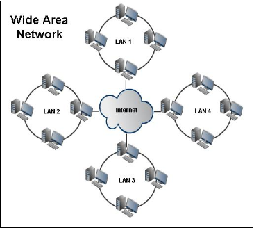

# 그림으로 배우는 네트워크 (NetWork) 원리

## 1. 네트워크의 기본

### 1-01. 무엇을 위해서 네트워크를 이용할까?

- 네트워크란?
```
넓은 의미에서 네트워크에는 물류, 교통, 인맥 등도 포함된다.  
그물처럼 구성된 시스템을 나타내는 말이다.
```

- 컴퓨터 네트워크
```
PC나 스마트폰과 같은 정보 단말 기기를 서로 연결해서 만들어 지는 것으로,  
다른 사람과 데이터를 주고받는 용도로 사용된다.
```

- 네트워크를 이용하는 목적
```
- 정보를 수집한다.
- 문서 파일 등을 공유한다.
- 효율적으로 커뮤니케이션한다.
- 출장 신청이나 정산 등의 업무를 처리한다.
이처럼 네트워크는 정보 수집이나 커뮤니케이션 효율화 등 다양한 목적을 위해 이용된다.
```

### 1-02. 누가 이용할 수 있는 네트워크인가?

- 사설 네트워크
```
사내 네트워크나 가정 네트워크처럼 접속할 수 있는 사용자를 직원이나  
가족으로 한정하는 네트워크를 "사설 네트워크"라 부른다.
```

- 인터넷
```
접속할 사용자를 제한하지 않고, 누구든 이용할 수 있는 네트워크.  
다른 사용자들과 자유롭게 데이터를 주고받을 수 있다.
```

- 네트워크의 가치
```
접속할 수 있는 사용자가 많아질수록 네트워크의 가치가 높아진다.  
그래서 네트워크의 이용 가치를 높이고, 사용자가 더 많은 장점을 누릴 수 있도록  
사설 네트워크를 인터넷에 연결하는 경우가 대부분이다.

EX) 사내 네트워크는 회사 직원들하고만 통신이 가능하고,  
가정 네트워크는 가족끼리만 통신할 수 있기 때문에 다른 사람과 통신하기 위해서는  
인터넷을 연결한다.
```

### 1-03. 사내 네트워크 구성
- LAN (Local Area Network)
```
지역 네트워크  
EX) 학교, 회사, 집 - 컴퓨터, 전화기 등의 장비 연결  
이때 컴퓨터끼리 1대1 직접 연결이 아닌  
공유기나 스위치 등을 이용하여 연결한다.
```

- WAN (Wide Area Network)
```
LAN과 LAN을 연결하여 광범위한 지역 단위로 구성하는 네트워크
```



| | LAN | WAN |
|---|---|---|
| 역할 | 거점 내 기기끼리 서로 연결한다. | 거점인 LAN끼리 서로 연결한다.  |
| 구축 및 관리 | 직접 구축하고 관리한다. | 통신사업자가 구축하고 관리한다. |
| 초기 비용 | 설계와 구축 인건비, 기기 비용 | 서비스 계약 요금 |
| 관리 비용 | 관리자 인건비 | 통신요금 |


### 1-04. 네트워크의 네트워크

- AS (Autonomous System)
```
하나의 조직 네트워크를 AS라고 한다.
```
- ISP (Internet Service Provider)
```
개인이나 기업체에게 인터넷 접속 서비스, 웹사이트 구축 및  
웹호스팅 서비스 등을 제공하는 회사를 말한다.  
대표적으로 한국에서는 KT, SKT, LG U+ 가 존재한다.
```
- ISP 종류

|고정회선||
|---|---|
|전용선|통신 속도는 보장되지만 비용이 비싸다.|
|전화회선(ADSL)|전화회선을 이용해 저가에 인터넷에 접속할 수 있다.|
|광케이블(FTTH)|광케이블응 이용해 고속으로 인터넷에 접속할 수 있다.|
|케이블 TV 회선|케이블 TV 회선을 인터넷 접속에도 이용한다.|

|모바일 회선||
|---|---|
|휴대전화망(4G LTE)|휴대전화망을 이용한 광역 인터넷 접속이 가능하다.|
|WiMAX/WiMAX2 회선|WiMAX망을 이용한 광역 인터넷 접속이 가능하다.|
|무선 LAN(Wi-Fi)|Wi-Fi 액세스 포인트의 제한도니 범위에서 인터넷에 접속할 수 있다.|

### 1-05. 무엇이 데이터를 주고받을까?

- 애플리케이션
```
데이터를 주고받는 주체는 주로 "애플리케이션"  
애플리케이션을 동작시키는 컴퓨터는 클라이언트와 서버로 분류할 수 있다.  
  
웹사이트 경우  
PC나 스마트폰에서 웹브라우저를 동작시킨다. (클라이언트)  
서버에서는 애플리케이션이 동작한다. (서버)  
서버에 요청(Request)를 보내고, 결과를 응답(Response)를 받는다.  
요청과 응답 데이터를 주고 받는 것이 애플리케이션의 기능이 작동하는 것.  
즉, 애플리케이션 통신은 양방향이다.
```

- 피어투피어 애플리케이션
```
서버를 거치지 않고 클라이언트끼리 직접 데이터를 주고받는 애플리케이션.  
단, 통신 상대를 특정하고자 서버를 이용하는 경우도 있다.  
ex) SNS, 온라인 게임 등
```

### 1-06. 통신에서 이용하는 언어

- 프로토콜
```
한국어나 영어와 같이 사람들이 언어를 통해 대화를 하듯이,  
컴퓨터 통신에서는 "네트워크 아키텍처"를 이용한다.  
"네트워크 아키텍처"는 통신 상대를 지정하는 법,  
데이터 형식, 통신 절차 등의 규칙이 필요하고,  
이러한 규칙을 "프로토콜"이라고 부른다.  

복수의 프로토콜을 조합한 네트워크 아키텍처에 기반하여 통신을 한다.
```

- TCP/IP
```
네트워크의 공통 언어로 TXP/IP를 주로 사용한다.  
네트워크를 통해 애플리케이션의 데이터를 주고받기 위해,  
역할별로 네 가지로 계층화된 복수의 프로토콜을 조합한다.  
프로토콜을 계층화하면, 나중에 변경하거나 확장하기 쉬워지는 장점이 있다.  
```

- 네트워크 아키텍처의 예
```
- TCP/IP, OSI, Microsoft NETBEUI, Novell IPX/SPX / Apple Appletalk / IBM SNA
```

- TCP/IC의 계층
```
- 애플리케이션층 : HTTP, SMTP, POP3, IMAP4, DHCP, DNS ...
- 트랜스포트층 : TCP, UDP ...
- 인터넷층 : IP, ICMP, ARP ...
- 네트워크 인터페이스층 : 이더넷, 무선 LAN, PPP 등
```

### 1-07. 서버를 운용-관리한다.

- 서버 운용-관리의 어려운 점
```
서버를 도입하려면 적절한 하드웨어를 선정해 OS와 서버 애플리케이션을  
설치하고 테스트 해야 한다.  
중요한 데이터를 다루는 서버에서는 서버의 상태를 항상 감시하고 있으며,  
뭔가 문제가 발생하면 바로 대처해야 한다.  
데이터도 항상 백업 해두어야 하며, 피룡에 따라서는 처리 능력을 확장할 필요가 있다.  
보안 대책도 중요하며 여러 고려할 사항들이 많기에  
서버 운용 관리에는 시간과 비용이 많이 들어간다.
```

- 클라우드
```
서버를 직접 관리하지 않고, AWS, 네이버 클라우드처럼 다른 회사에서 제공해주는  
클라우드 서비스를 활용하여 직접 서버(하드웨어 등)을 관리하지 않아도 되게 되었다.  

예전 직접 서버를 운용 관리하던 방식은 "온프레미스"라고 불렀다.
```

- 클라우드 서비스 장단점
```
예전에는 용량이 부족하다면, 하드웨어를 더 사서 추가하거나 컴퓨터를 늘리곤 하였지만,  
클라우드 경우 계약만 변경하면 쉽게 늘리고 줄일 수 있다.  
하지만, 보안이나 가용성에 주의가 필요하다.  
자신의 고나리가 미치지 않는 범위에서 데이터가 유지되는 점과 서비스를 이용할 수 없게  
될 가능성도 있다는 점을 생각해야 한다.
```

### 1-08. 서버의 어느 부분을 사용하지? 클라우드 서비스의 분류

- IaaS (Infrastructure as Service, 이아스)
```
서버의 CPU, 메모리, 저장장치와 같은 하드웨어 부분을 이용할 수 있는 서비스  
EX) AWS - EC2
```
- Paas (Platform as a Service, 파스)
```
서버의 플랫폼을 이용할 수 있는 서비스  
주로 응용프로그램을 개발할 때 필요한 플랫폼을 제공한다.  
개발사는 미들웨어를 설치하지 않고도 PaaS에서 제공하는  
API를 통해 소프트웨어 개발이 가능하다.  
EX) AWS - Lamda
```

- SaaS (Software as a Service, 사스)
```
서버의 특정 소프트웨어 기능을 이용하는 서비스  
EX) 해외 세일즈 포스 ERP, 국내 와탭랩스 IT 모니터링 서비스
```
